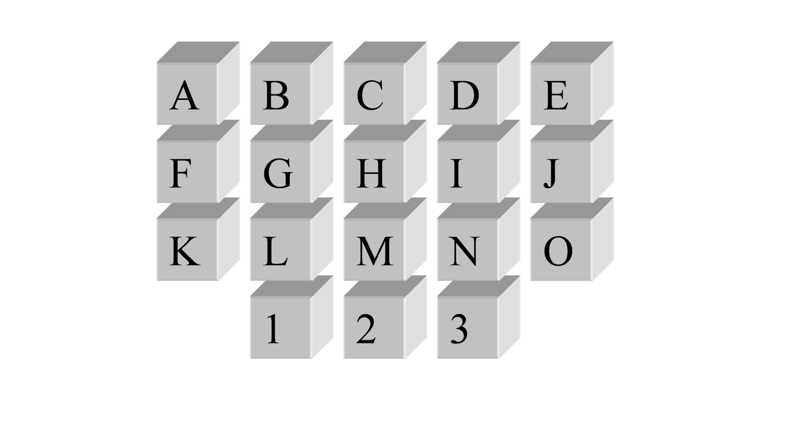
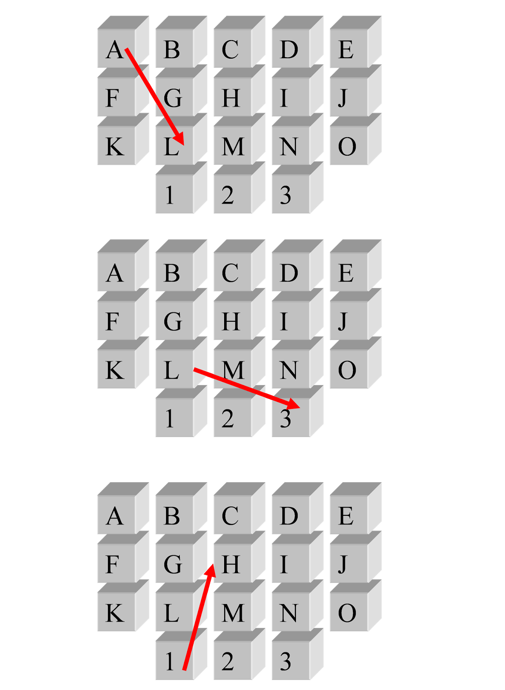

# Knight Moves Problem

Pictured here is a keypad:  

Find all sequences of length *n* that can be keyed into the keypad in the following manner:
* The initial keypress can be any of the keys.
* Each subsequent keypress must be a *knight move* from the previous keypress.
* There can be at most 2 vowels in the sequence.
* We will attempt to run your solution for *n* = 10, 16 and 32.

A knight move is made in one of the following ways:
* Move two steps horizontally and one step vertically.
* Move two steps vertically and one step horizontally.

There is no wrapping allowed on a knight move.

Here are some examples of knight moves: 